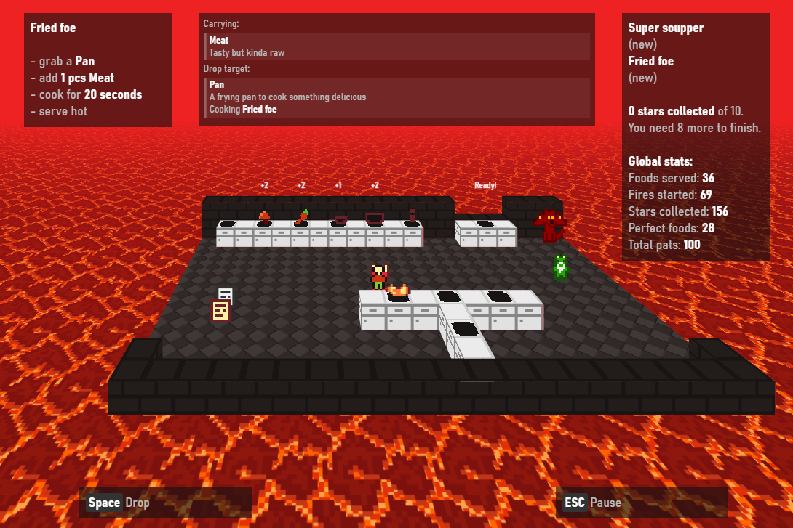

# Cooking for Skully

An entry for the [js13kgames](https://js13kgames.com/) [2022](http://2022.js13kgames.com/) gamejam for the theme "death".

Entry: https://js13kgames.com/entries/cooking-for-skully

# Details

The game is about the Devil who is asked by Skully (aka. Death) to cook
some meal for him.

The Devil is controlled by the player, they need to prepare dishes with
various ingredients and seasoning based on recipes then Skully judges
their performance by 5-star rating.

Goblin (finding a better name is still on the TODO list) tries to guide
the player and introduce them to new elements.

And also, there is Cerberus, the three headed pup who takes care of any
leftovers.

The game is created with HTML5 + TypeScript + CSS, GIMP for graphics.

The graphics is displayed using CSS3D, it also has Bonus features [...]

For the release I use a build.sh to merge all TypeScript sources and use
[typescript-closure-compiler](https://www.npmjs.com/package/typescript-closure-compiler)
to transpile the bundle to JavaScript (ECMAScript 5), which is then compressed by
[google-closure-compiler](https://www.npmjs.com/package/google-closure-compiler).
The output gets embedded into a minimized HTML file, alongside with
CSS and the images, then the hand-minimized server.js gets copied and
these two files are compressed into a single ZIP file, which then gets
recompressed by [advancecomp](https://github.com/amadvance/advancecomp)'s
AdvZIP to be able to squeeze a few more bytes (can shave off 4% compared
to the standard high compression ZIP).

# Screenshots

